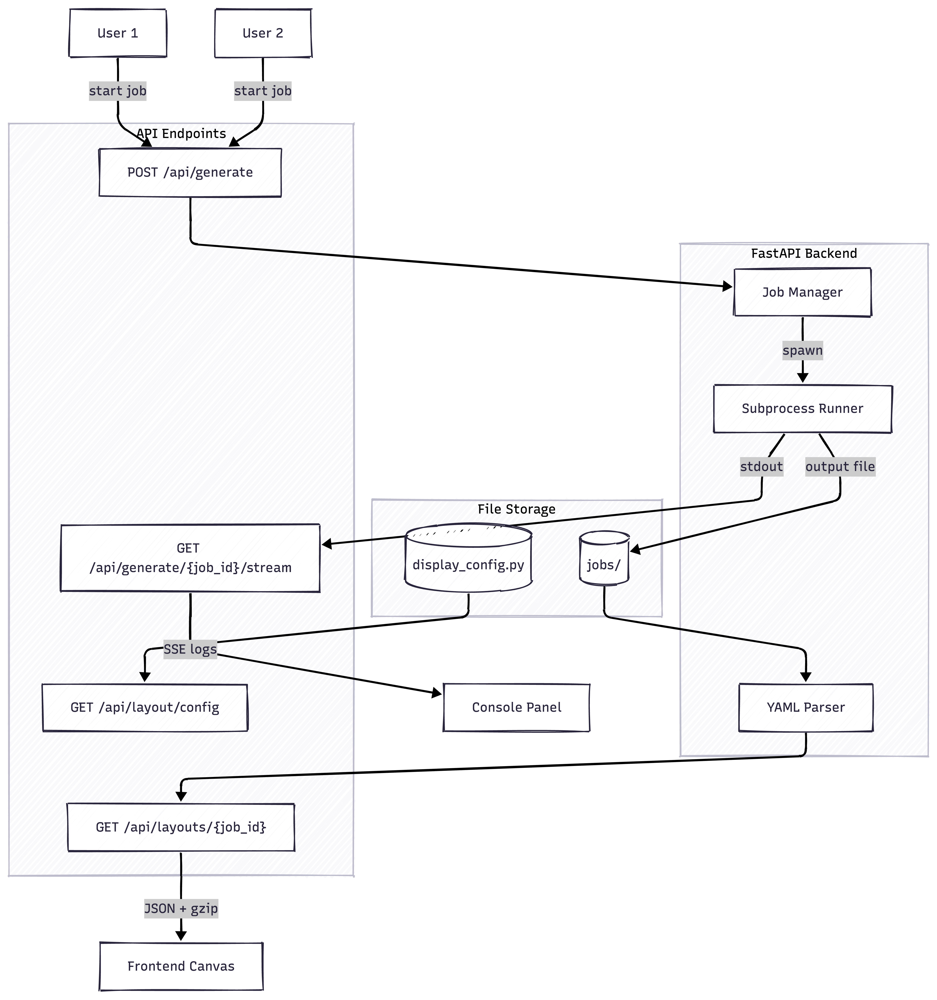

# Layout Copilot Backend

This backend serves IC layout data and streams generator logs to the frontend.
It supports concurrent, per-user layout generation jobs and SSE log streaming.

## Architecture

## Multi-User Job System

Each layout generation request creates a unique job:

- **Job ID**: UUID assigned on generation request
- **Job Status**: pending, running, completed, failed
- **Output File**: `jobs/{job_id}/layout.yaml` - isolated per job
- **Concurrent Jobs**: Multiple users can run generations simultaneously

## API Endpoints

| Endpoint                        | Method | Description                                       |
| ------------------------------- | ------ | ------------------------------------------------- |
| `/api/generate`                 | POST   | Start layout generation, returns job_id           |
| `/api/generate/{job_id}/stream` | GET    | SSE endpoint for streaming logs of a specific job |
| `/api/generate/{job_id}/status` | GET    | Get job status (pending/running/completed/failed) |
| `/api/layouts/{job_id}`         | GET    | Returns layout data for completed job             |
| `/api/layout/config`            | GET    | Returns layer display configuration               |

## Request/Response Flow

**Starting a generation:**

1. Frontend POSTs to `/api/generate` with optional parameters
2. Backend creates job, returns `{ job_id: "uuid", status: "pending" }`
3. Frontend connects to `/api/generate/{job_id}/stream` (SSE)
4. Backend spawns subprocess, streams stdout as SSE events
5. On completion, sends `complete` event with status

**Fetching layout data:**

1. Frontend calls `/api/layouts/{job_id}` after job completes
2. Backend parses YAML from `jobs/{job_id}/layout.yaml`
3. Returns compressed JSON with polygons, labels, canvas dimensions

