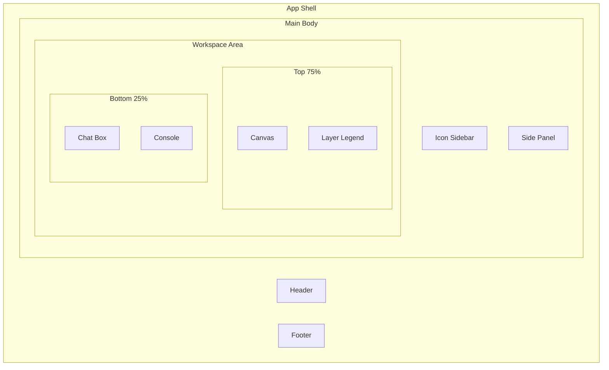

# Frontend Layout Copilot UI

## Design Breakdown

Mapping the mockup to a component hierarchy:



## Existing shadcn Components Available

Already installed in `[frontend/src/components/ui/](frontend/src/components/ui/)`:

- `Card` -- for Console, Chat box, Legend panels
- `Button` -- for all actions (Create Library, Generate Layout, Send, etc.)
- `Input` -- for chat message input
- `Separator` -- for dividing side panel sections
- `Badge` -- for status indicators
- `Label` -- for section headers

## shadcn Components to Add

These need to be installed via `npx shadcn add`:

- **Tabs** -- Cell View S-Cells/Modules toggle (if desired) and any tabbed sections
- **ScrollArea** -- scrollable lists in side panel and console
- **Tooltip** -- icon sidebar hover labels (Dashboard, Analytics, etc.)
- **Checkbox** -- layer visibility toggles in the legend
- **Resizable** -- draggable divider between top 75% and bottom 25%
- **Sidebar** -- shadcn sidebar component for the collapsible icon sidebar

## Layout Structure

The overall page uses CSS Grid with fixed header/footer and a fluid middle:

```
+----------------------------------------------+
| Header                                       |
+------+--------+--------------------+---------+
| Icon | Side   | Canvas             | Legend  |
| Bar  | Panel  |                    |        |
|      |        |                    |        |
|      |        +--------------------+---------+
|      |        | Chat Box  | Console          |
+------+--------+-----------+------------------+
| Footer                                       |
+----------------------------------------------+
```

## Component Plan

### 1. App Shell (`src/App.tsx`)

- Full-viewport grid: `grid-rows-[auto_1fr_auto]`
- Contains `<Header>`, `<MainLayout>`, `<Footer>`

### 2. Header (`src/components/layout/Header.tsx`)

- Simple bar with app title "CUAS Layout Copilot"
- Use a `div` with `border-b` styling

### 3. Footer (`src/components/layout/Footer.tsx`)

- Minimal footer bar with border-top

### 4. Icon Sidebar (`src/components/layout/IconSidebar.tsx`)

- Narrow vertical bar (~60px) with icon buttons
- Icons from lucide-react: `LayoutDashboard`, `BarChart3`, `Layers`, `Settings`
- Labels: Dashboard, Analytics, Layers, Settings
- Collapse arrow at bottom
- Use shadcn `Tooltip` for hover labels
- Use shadcn `Button` variant="ghost" size="icon"

### 5. Side Panel (`src/components/panels/SidePanel.tsx`)

- Collapsible panel (~280px) with chevron toggle
- Three vertically stacked sections separated by `Separator`:

**Section A -- Library View:**

- Section header "Library View"
- Scrollable list of library names (shadcn `ScrollArea`)
- Clicking a library selects it (highlight)
- Two buttons at bottom: "Create Library" + "Delete Library"

**Section B -- Cell View:**

- Section header "Cell View"
- Two-tab toggle: "S-Cells" | "Modules" (shadcn `Tabs`)
- Scrollable list of cells for selected library
- Clicking a cell selects it

**Section C -- Layout View:**

- Section header "Layout View"
- Scrollable list of layouts for selected cell
- One action buttons: "Create New"
- Three menu buttons for each layout: "Modify", "Generate Layout", "Delete"
- "Generate Layout" button wired to `POST /api/generate`

### 6. Canvas (`src/components/canvas/LayoutCanvas.tsx`)

- Takes ~75% of vertical workspace
- HTML5 `<canvas>` element that renders polygons from layout data
- Fetches data from `GET /api/layouts/{job_id}` after generation completes
- Fetches layer config from `GET /api/layout/config`
- Renders rectangles per polygon using layer colors/alpha/zorder from config

### 7. Layer Legend (`src/components/panels/LayerLegend.tsx`)

- Right side panel inside workspace area
- Uses shadcn `Card` container
- Header: "Cell Layers"
- Each layer row: shadcn `Checkbox` + color swatch (small div with background-color) + layer name
- Grouped by category: "All Polygons", "All Metals", "All Vias" (matching the screenshot)
- Toggling visibility controls which layers render on canvas

### 8. Console (`src/components/panels/Console.tsx`)

- Bottom-right panel (~50% of bottom 25%)
- shadcn `Card` with header "Console"
- shadcn `ScrollArea` for log output
- Connects to `GET /api/generate/{job_id}/stream` via `EventSource`
- Auto-scrolls to bottom on new messages
- Monospace font for log lines

### 9. Chat Box (`src/components/panels/ChatBox.tsx`)

- Bottom-left panel (~50% of bottom 25%)
- shadcn `Card` with header "Chat box"
- Message display area (shadcn `ScrollArea`)
- Input row at bottom: shadcn `Input` + shadcn `Button` with send icon
- Placeholder only -- no backend wiring yet

## State Management

Client-side React state (no external state library needed yet):

- **Library/Cell/Layout hierarchy**: `useState` in SidePanel, passed down
- **Selected library/cell/layout**: lifted to App or context
- **Console logs**: `useState` array in Console, populated from SSE
- **Active job ID**: set when "Generate Layout" is clicked, used to connect SSE and fetch layout
- **Layer visibility**: `useState` map in workspace, shared between Legend and Canvas
- **Layout data**: fetched after job completes, stored in workspace state
- **Layer config**: fetched once on mount

## SSE Integration (`src/hooks/useJobStream.ts`)

Custom hook:

```typescript
function useJobStream(jobId: string | null) {
  // Returns { logs, status, isStreaming }
  // Opens EventSource to /api/generate/{jobId}/stream
  // Listens for "log" and "complete" events
  // Cleans up on unmount or jobId change
}
```

## API Client (`src/lib/api.ts`)

Simple fetch wrappers:

- `startGeneration(cellName)` -- POST /api/generate
- `getLayout(jobId)` -- GET /api/layouts/{jobId}
- `getLayoutConfig()` -- GET /api/layout/config
- `getJobStatus(jobId)` -- GET /api/generate/{jobId}/status

## File Structure

```
src/
  App.tsx
  lib/
    api.ts              # API client functions
    utils.ts            # Existing
  hooks/
    useJobStream.ts     # SSE hook
  components/
    layout/
      Header.tsx
      Footer.tsx
      IconSidebar.tsx
      MainLayout.tsx    # Grid container for sidebar + workspace
    panels/
      SidePanel.tsx     # Library > Cell > Layout hierarchy
      LayerLegend.tsx   # Checkbox layer visibility
      Console.tsx       # SSE log viewer
      ChatBox.tsx       # Placeholder chat
    canvas/
      LayoutCanvas.tsx  # HTML5 canvas renderer
    ui/                 # Existing shadcn componenwoTe
```
